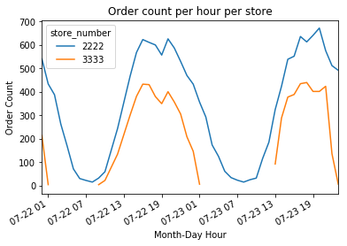

## Analysis Summary 
Task: Analyze sales over 2 days from 2 different stores

Assumptions: 
* The distribution of sales and items are similar throughout the week. (The weekend might sell more items but # upcs sold is about the same)

### High Level Findings
#### Store #2222 is definately a Super Walmart
* Store #2222 sold 46,086 unique upc items.
* Store #3333 sold 5,752 unique upc items.

#### Store #3333 seems to be a more effecient store (Sam's Club? Who buys $22 of Twizzlers?)
* It holds less unique items but proportionally sells more. Store #2222 moved 4.8x inventory but only 2.3x more gross sales. 
* Open less hours than store #2222
* Store #2222 supports 8x more unique upc items
* Store #3333 sells less items for more money across less hours. It has reduced overhead due to supporting a less diverse inventory.

### Data Findings
#### Comparison using Department numbers is difficult
* Department numbers are not standardized. 
* Example twizzlers is sold in multiple departments in #2222 but only 1 in #3333
* It is unknown how departments are organized either by category or location.

#### Comparison using UPC numbers is difficult
* 4 UPC numbers matched across stores
* 415 items matched using name

### Further Work
* Implement product categorization
Current limitations: Need truth labels
Example approach:
https://techblog.commercetools.com/boosting-product-categorization-with-machine-learning-ad4dbd30b0e8
* Compare department locations across stores (back of store A vs back of store B)
* Compare product categories across stores (determine difference in electronic sales etc)


```python
import numpy as np
import pandas as pd
import matplotlib.pyplot as plt
```


```python
# read data
sales_data = pd.read_csv('4729-2038.tsv', sep='\t')
sales_data.head()
```


<div>
<style>
    .dataframe thead tr:only-child th {
        text-align: right;
    }

    .dataframe thead th {
        text-align: left;
    }

    .dataframe tbody tr th {
        vertical-align: top;
    }
</style>
<table border="1" class="dataframe">
  <thead>
    <tr style="text-align: right;">
      <th></th>
      <th>id</th>
      <th>order_id</th>
      <th>order_time</th>
      <th>store_number</th>
      <th>department</th>
      <th>register</th>
      <th>amount</th>
      <th>upc</th>
      <th>name</th>
      <th>description</th>
    </tr>
  </thead>
  <tbody>
    <tr>
      <th>0</th>
      <td>44098873602538434607-0000000000715756200020-1</td>
      <td>44098873602538434607</td>
      <td>1500720834000</td>
      <td>2222</td>
      <td>94</td>
      <td>43</td>
      <td>1.98</td>
      <td>0000000000715756200020</td>
      <td>STRAWBERRIES</td>
      <td>STRAWBERRY 1</td>
    </tr>
    <tr>
      <th>1</th>
      <td>44098873602538434607-0000000000074641006050-2</td>
      <td>44098873602538434607</td>
      <td>1500720834000</td>
      <td>2222</td>
      <td>94</td>
      <td>43</td>
      <td>2.48</td>
      <td>0000000000074641006050</td>
      <td>RED GRAPES</td>
      <td>RED GRAPES 10Z CF</td>
    </tr>
    <tr>
      <th>2</th>
      <td>44098873602538434607-0000000000078742147150-3</td>
      <td>44098873602538434607</td>
      <td>1500720834000</td>
      <td>2222</td>
      <td>92</td>
      <td>43</td>
      <td>3.92</td>
      <td>0000000000078742147150</td>
      <td>GV OR PB CRN</td>
      <td>GV ORG PB CRUNCHY</td>
    </tr>
    <tr>
      <th>3</th>
      <td>44098873602538434607-0000000000078742116760-4</td>
      <td>44098873602538434607</td>
      <td>1500720834000</td>
      <td>2222</td>
      <td>4</td>
      <td>43</td>
      <td>2.48</td>
      <td>0000000000078742116760</td>
      <td>ASST CUTLERY</td>
      <td>GV PRM FS ASST 48CT</td>
    </tr>
    <tr>
      <th>4</th>
      <td>44098873602538434607-0000000000016000432680-5</td>
      <td>44098873602538434607</td>
      <td>1500720834000</td>
      <td>2222</td>
      <td>92</td>
      <td>43</td>
      <td>3.77</td>
      <td>0000000000016000432680</td>
      <td>GRANOLA</td>
      <td>NV OAT N HNY GRAN</td>
    </tr>
  </tbody>
</table>
</div>


```python
# stores
sales_data['store_number'].unique()
```


    array([2222, 3333])


```python
# no of unique items sold per store
sales_data.groupby('store_number')['upc'].nunique()
```


    store_number
    2222    46086
    3333     5752
    Name: upc, dtype: int64


```python
# no of departments per store
sales_data.groupby(['store_number'])['department'].nunique()
```


    store_number
    2222    67
    3333    84
    Name: department, dtype: int64


```python
# no of inventory sold per store
sales_data.groupby('store_number')['id'].count()
```


    store_number
    2222    176773
    3333     36722
    Name: id, dtype: int64


```python
sales_data.groupby('store_number')['amount'].sum()
```


    store_number
    2222    838234.189999
    3333    358681.460000
    Name: amount, dtype: float64


```python
sales_data['order_time'].head() # looks like epoch time with miliseconds
```


    0    1500720834000
    1    1500720834000
    2    1500720834000
    3    1500720834000
    4    1500720834000
    Name: order_time, dtype: int64


```python
# check how many rows end with 000
sales_data['order_time'][~sales_data['order_time'].astype(str).str.endswith("000")]
```


    Series([], Name: order_time, dtype: int64)


```python
# convert order_time column to datetime object
sales_data['order_time'] = pd.to_datetime(sales_data['order_time'],unit='ms')
sales_data['order_time'].head()
```


    0   2017-07-22 10:53:54
    1   2017-07-22 10:53:54
    2   2017-07-22 10:53:54
    3   2017-07-22 10:53:54
    4   2017-07-22 10:53:54
    Name: order_time, dtype: datetime64[ns]


```python
# plot amount of money made total per hour for each store
sales_data.groupby([pd.TimeGrouper(key='order_time', freq='H'), 'store_number'])['amount'].sum().unstack().plot()
plt.xlabel("Month-Day Hour")
plt.ylabel("Total sales ($)")
plt.title("Sales per hour per store")
plt.show()
```


```python
sales_data.groupby([pd.TimeGrouper(key='order_time', freq='H'), 'store_number'])['upc'].nunique().unstack().plot()
plt.xlabel("Month-Day Hour")
plt.ylabel("Item count")
plt.title("Unique items per hour per store")
plt.show()
```


```python
# create order statistics
date = sales_data['order_time']
total_order_price = pd.DataFrame(sales_data.groupby(['store_number', 'order_id'])['amount'].sum())
total_order_price.columns = ['order_amount']
total_order_price.reset_index(inplace=True)

count_order_items = pd.DataFrame(sales_data.groupby(['store_number', 'order_id'])['upc'].count())
count_order_items.columns = ['item_count']
count_order_items.reset_index(inplace=True)


average_amount_items = pd.DataFrame(sales_data.groupby(['store_number', 'order_id'])['amount'].mean())
average_amount_items.columns = ['item_amount_average']
average_amount_items.reset_index(inplace=True)

order_data = total_order_price.merge(sales_data).merge(count_order_items).merge(average_amount_items)
order_data = order_data[['order_time','order_id', 'store_number', 'order_amount', 'item_count', 'item_amount_average']].drop_duplicates()
order_data.head()
```


<div>
<style>
    .dataframe thead tr:only-child th {
        text-align: right;
    }

    .dataframe thead th {
        text-align: left;
    }

    .dataframe tbody tr th {
        vertical-align: top;
    }
</style>
<table border="1" class="dataframe">
  <thead>
    <tr style="text-align: right;">
      <th></th>
      <th>order_time</th>
      <th>order_id</th>
      <th>store_number</th>
      <th>order_amount</th>
      <th>item_count</th>
      <th>item_amount_average</th>
    </tr>
  </thead>
  <tbody>
    <tr>
      <th>0</th>
      <td>2017-07-23 21:28:52</td>
      <td>00006280410953249418</td>
      <td>2222</td>
      <td>47.22</td>
      <td>8</td>
      <td>5.902500</td>
    </tr>
    <tr>
      <th>8</th>
      <td>2017-07-23 17:17:20</td>
      <td>00006280468956221468</td>
      <td>2222</td>
      <td>38.97</td>
      <td>1</td>
      <td>38.970000</td>
    </tr>
    <tr>
      <th>9</th>
      <td>2017-07-23 22:04:57</td>
      <td>00006382436950267448</td>
      <td>2222</td>
      <td>40.42</td>
      <td>15</td>
      <td>2.694667</td>
    </tr>
    <tr>
      <th>24</th>
      <td>2017-07-23 14:07:37</td>
      <td>00006586436954237438</td>
      <td>2222</td>
      <td>43.98</td>
      <td>5</td>
      <td>8.796000</td>
    </tr>
    <tr>
      <th>29</th>
      <td>2017-07-23 18:46:19</td>
      <td>00006681446956273468</td>
      <td>2222</td>
      <td>39.54</td>
      <td>7</td>
      <td>5.648571</td>
    </tr>
  </tbody>
</table>
</div>


```python
# plot average transaction amount per hour for each store across both days
order_data.groupby([pd.TimeGrouper(key='order_time', freq='H'), 'store_number'])['order_amount'].mean().unstack().plot()
plt.xlabel("Month-Day Hour")
plt.ylabel("Average Order ($)")
plt.title("Order average amount per hour per store")
plt.show()
```


```python
order_data.groupby([pd.TimeGrouper(key='order_time', freq='H'), 'store_number'])['order_id'].count().unstack().plot()
plt.xlabel("Month-Day Hour")
plt.ylabel("Order Count")
plt.title("Order count per hour per store")
plt.show()
```





```python
order_data.groupby([pd.TimeGrouper(key='order_time', freq='H'), 'store_number'])['item_count'].mean().unstack().plot()
plt.xlabel("Month-Day Hour")
plt.ylabel("Average Item count")
plt.title("Average Item count per hour per store")
plt.show()
```


```python
dept_sales = sales_data.groupby(['store_number', 'department'])['amount'].sum().groupby(level=0).nlargest(10)
pd.DataFrame(dept_sales).sort_values('amount', ascending=False).plot.bar()
plt.ylabel("Total sales ($)")
plt.title("Top 10 gross department sales per store")
plt.show()
```


```python
dept_sales = sales_data.groupby(['store_number', 'department'])['amount'].mean().groupby(level=0).nlargest(10)
pd.DataFrame(dept_sales).sort_values('amount', ascending=False).plot.bar()
plt.ylabel("Average sales ($)")
plt.title("Top 10 avg department sales per store")
plt.show()
```


```python
## Top 3 department 3333
# TV electronic
# sales_data[(sales_data['store_number'] == 3333)
#           & (sales_data['department'] == 5)]['description'].head()

# jewelry
# sales_data[(sales_data['store_number'] == 3333)
#           & (sales_data['department'] == 67)]['description'].head()

# camera electronic
# sales_data[(sales_data['store_number'] == 3333)
#           & (sales_data['department'] == 6)]['description'].head()


## Top 4 department 222
# bill pay check cash
# sales_data[(sales_data['store_number'] == 2222)
#           & (sales_data['department'] == 86)]['description'].head()

# electronic
# sales_data[(sales_data['store_number'] == 2222)
#           & (sales_data['department'] == 72)]['description'].head()

# pharmacy
# sales_data[(sales_data['store_number'] == 2222)
#           & (sales_data['department'] == 38)]['description'].head()

# furniture
# sales_data[(sales_data['store_number'] == 2222)
#           & (sales_data['department'] == 71)]['description'].head()
```


```python
# only 4 common upc numbers

# products that sell at both stores
s1 = sales_data[sales_data['store_number'] == 2222]['name']
s2 = sales_data[sales_data['store_number'] == 3333]['name']
common_name = pd.Series(list(set(s1).intersection(set(s2))))
common_name = pd.DataFrame(common_name)
common_name.columns = ['common_name']
print(common_name.shape)
common_name.head()
```

    (415, 1)


<div>
<style>
    .dataframe thead tr:only-child th {
        text-align: right;
    }

    .dataframe thead th {
        text-align: left;
    }

    .dataframe tbody tr th {
        vertical-align: top;
    }
</style>
<table border="1" class="dataframe">
  <thead>
    <tr style="text-align: right;">
      <th></th>
      <th>common_name</th>
    </tr>
  </thead>
  <tbody>
    <tr>
      <th>0</th>
      <td>SALSA</td>
    </tr>
    <tr>
      <th>1</th>
      <td>SKIM MILK</td>
    </tr>
    <tr>
      <th>2</th>
      <td>SWIFFER</td>
    </tr>
    <tr>
      <th>3</th>
      <td>LENS WIPES</td>
    </tr>
    <tr>
      <th>4</th>
      <td>NECTARINES</td>
    </tr>
  </tbody>
</table>
</div>


```python
sales_data[(sales_data['name'] == 'TWIZZLERS')][['store_number', 'department', 'amount', 'name', 'description']].drop_duplicates()
```


<div>
<style>
    .dataframe thead tr:only-child th {
        text-align: right;
    }

    .dataframe thead th {
        text-align: left;
    }

    .dataframe tbody tr th {
        vertical-align: top;
    }
</style>
<table border="1" class="dataframe">
  <thead>
    <tr style="text-align: right;">
      <th></th>
      <th>store_number</th>
      <th>department</th>
      <th>amount</th>
      <th>name</th>
      <th>description</th>
    </tr>
  </thead>
  <tbody>
    <tr>
      <th>8377</th>
      <td>2222</td>
      <td>82</td>
      <td>1.34</td>
      <td>TWIZZLERS</td>
      <td>TWIZZLER KING 5OZ</td>
    </tr>
    <tr>
      <th>8378</th>
      <td>2222</td>
      <td>82</td>
      <td>-1.34</td>
      <td>TWIZZLERS</td>
      <td>TWIZZLER KING 5OZ</td>
    </tr>
    <tr>
      <th>23803</th>
      <td>2222</td>
      <td>1</td>
      <td>5.98</td>
      <td>TWIZZLERS</td>
      <td>TWIZ ASST RAINBOW</td>
    </tr>
    <tr>
      <th>36345</th>
      <td>2222</td>
      <td>1</td>
      <td>3.74</td>
      <td>TWIZZLERS</td>
      <td>TWIZLR TWST STRW FAM</td>
    </tr>
    <tr>
      <th>41121</th>
      <td>2222</td>
      <td>1</td>
      <td>3.74</td>
      <td>TWIZZLERS</td>
      <td>TWIZLR PNP CHRY FAM</td>
    </tr>
    <tr>
      <th>174504</th>
      <td>3333</td>
      <td>1</td>
      <td>21.98</td>
      <td>TWIZZLERS</td>
      <td>TWIZZLERS STRAWBERRY</td>
    </tr>
    <tr>
      <th>191555</th>
      <td>2222</td>
      <td>1</td>
      <td>1.84</td>
      <td>TWIZZLERS</td>
      <td>TWIZZLER RAINBOW MED</td>
    </tr>
  </tbody>
</table>
</div>


```python
# Find products that sell in both store
store_a = sales_data[sales_data['store_number'] == 2222]
store_b = sales_data[sales_data['store_number'] == 3333]
```


```python
common_a = store_a.merge(common_name, left_on="name", right_on="common_name")
print("From common item sales:")
print("Average item price sold:", common_a['amount'].mean())
print("Number of inventory sold:", common_a['id'].count())
print("Average transaction amount:", common_a.groupby('order_id')['amount'].sum().mean())
print("Total sales:", common_a['amount'].sum())
```

    From common item sales:
    Average item price sold: 3.5268357753359183
    Number of inventory sold: 16380
    Average transaction amount: 8.641670905011276
    Total sales: 57769.57000000234


```python
common_b = store_b.merge(common_name, left_on="name", right_on="common_name")
print("From common item sales:")
print("Average item price sold:", common_b['amount'].mean())
print("Number of inventory sold:", common_b['id'].count())
print("Average transaction amount:", common_b.groupby('order_id')['amount'].sum().mean())
print("Total sales:", common_b['amount'].sum())
```

    From common item sales:
    Average item price sold: 7.744085163824442
    Number of inventory sold: 8149
    Average transaction amount: 23.372796296296382
    Total sales: 63106.55000000538


```python

```


```python
store_a.count()
```


    id              176773
    order_id        176773
    order_time      176773
    store_number    176773
    department      176773
    register        176773
    amount          176773
    upc             176773
    name            176773
    description     176707
    dtype: int64


```python
# multiply arrays of num sold per hour and determine if something comes back
# indicator arrays of when products we sold
# use XOR to find where selling in one but not other
```


```python
# normalize departments (1 walart has gasoline the other does not)
# department mapping
```


```python
# product categorization
```


```python
sales_data[(sales_data['store_number'] == 2222) & 
           (sales_data['department'] == 40) &
          (sales_data['upc'] == "0000000000312547171570")
          ].head()
```


<div>
<style>
    .dataframe thead tr:only-child th {
        text-align: right;
    }

    .dataframe thead th {
        text-align: left;
    }

    .dataframe tbody tr th {
        vertical-align: top;
    }
</style>
<table border="1" class="dataframe">
  <thead>
    <tr style="text-align: right;">
      <th></th>
      <th>id</th>
      <th>order_id</th>
      <th>order_time</th>
      <th>store_number</th>
      <th>department</th>
      <th>register</th>
      <th>amount</th>
      <th>upc</th>
      <th>name</th>
      <th>description</th>
    </tr>
  </thead>
  <tbody>
    <tr>
      <th>69</th>
      <td>15841703399468542370-0000000000312547171570-16</td>
      <td>15841703399468542370</td>
      <td>2017-07-22 10:38:49</td>
      <td>2222</td>
      <td>40</td>
      <td>49</td>
      <td>5.32</td>
      <td>0000000000312547171570</td>
      <td>BENADRYL GEL</td>
      <td>BENADRYL ES ITCH GEL</td>
    </tr>
    <tr>
      <th>28155</th>
      <td>48079658729102811775-0000000000312547171570-7</td>
      <td>48079658729102811775</td>
      <td>2017-07-22 10:43:01</td>
      <td>2222</td>
      <td>40</td>
      <td>18</td>
      <td>5.32</td>
      <td>0000000000312547171570</td>
      <td>BENADRYL GEL</td>
      <td>BENADRYL ES ITCH GEL</td>
    </tr>
  </tbody>
</table>
</div>


```python
sales_data[(sales_data['store_number'] == 3333) & 
#            (sales_data['department'] == 40) &
          (sales_data['name'].str.contains("BENADRYL"))
          ].head()
```


<div>
<style>
    .dataframe thead tr:only-child th {
        text-align: right;
    }

    .dataframe thead th {
        text-align: left;
    }

    .dataframe tbody tr th {
        vertical-align: top;
    }
</style>
<table border="1" class="dataframe">
  <thead>
    <tr style="text-align: right;">
      <th></th>
      <th>id</th>
      <th>order_id</th>
      <th>order_time</th>
      <th>store_number</th>
      <th>department</th>
      <th>register</th>
      <th>amount</th>
      <th>upc</th>
      <th>name</th>
      <th>description</th>
    </tr>
  </thead>
  <tbody>
    <tr>
      <th>56682</th>
      <td>6678292849514811441-0000000000030045055725-2</td>
      <td>6678292849514811441</td>
      <td>2017-07-22 21:43:58</td>
      <td>3333</td>
      <td>54</td>
      <td>7</td>
      <td>13.68</td>
      <td>0000000000030045055725</td>
      <td>BENADRYL</td>
      <td>BENADRYL ULTRA TABS</td>
    </tr>
    <tr>
      <th>179618</th>
      <td>99241004390265306946-0000000000030045055725-4</td>
      <td>99241004390265306946</td>
      <td>2017-07-23 20:24:02</td>
      <td>3333</td>
      <td>54</td>
      <td>7</td>
      <td>13.68</td>
      <td>0000000000030045055725</td>
      <td>BENADRYL</td>
      <td>BENADRYL ULTRA TABS</td>
    </tr>
  </tbody>
</table>
</div>


```python
sales_data[(sales_data['store_number'] == 2222) & 
#            (sales_data['department'] == 94)
          (sales_data['name'].str.contains("OREO"))
          ]
```


<div>
<style>
    .dataframe thead tr:only-child th {
        text-align: right;
    }

    .dataframe thead th {
        text-align: left;
    }

    .dataframe tbody tr th {
        vertical-align: top;
    }
</style>
<table border="1" class="dataframe">
  <thead>
    <tr style="text-align: right;">
      <th></th>
      <th>id</th>
      <th>order_id</th>
      <th>order_time</th>
      <th>store_number</th>
      <th>department</th>
      <th>register</th>
      <th>amount</th>
      <th>upc</th>
      <th>name</th>
      <th>description</th>
    </tr>
  </thead>
  <tbody>
    <tr>
      <th>614</th>
      <td>16687591824312606839-0000000000884912268390-2</td>
      <td>16687591824312606839</td>
      <td>2017-07-22 15:24:37</td>
      <td>2222</td>
      <td>92</td>
      <td>43</td>
      <td>3.98</td>
      <td>0000000000884912268390</td>
      <td>OREO O S 19</td>
      <td>OREO O S 19OZ</td>
    </tr>
    <tr>
      <th>798</th>
      <td>37579956759106835705-0000000000044000025410-3</td>
      <td>37579956759106835705</td>
      <td>2017-07-22 01:44:18</td>
      <td>2222</td>
      <td>95</td>
      <td>10</td>
      <td>2.88</td>
      <td>0000000000044000025410</td>
      <td>OREO</td>
      <td>OREO OR PB CR 15.25Z</td>
    </tr>
    <tr>
      <th>1457</th>
      <td>959655837963027711903-0000000000070221008390-25</td>
      <td>959655837963027711903</td>
      <td>2017-07-22 00:02:48</td>
      <td>2222</td>
      <td>82</td>
      <td>9</td>
      <td>1.34</td>
      <td>0000000000070221008390</td>
      <td>MILKA OREO K</td>
      <td>2.88OZ MILKA OREO KS</td>
    </tr>
    <tr>
      <th>1827</th>
      <td>04198278687531460697-0000000000044000033230-3</td>
      <td>04198278687531460697</td>
      <td>2017-07-22 14:21:12</td>
      <td>2222</td>
      <td>95</td>
      <td>5</td>
      <td>2.88</td>
      <td>0000000000044000033230</td>
      <td>OREO</td>
      <td>OREO OR MEG ST 13.2Z</td>
    </tr>
    <tr>
      <th>2244</th>
      <td>492194360236790078266-0000000000044000015920-4</td>
      <td>492194360236790078266</td>
      <td>2017-07-22 00:40:43</td>
      <td>2222</td>
      <td>95</td>
      <td>9</td>
      <td>1.98</td>
      <td>0000000000044000015920</td>
      <td>OREO</td>
      <td>OREO ORG MINI BAG 8Z</td>
    </tr>
    <tr>
      <th>2249</th>
      <td>492194360236790078266-0000000000044000015920-9</td>
      <td>492194360236790078266</td>
      <td>2017-07-22 00:40:43</td>
      <td>2222</td>
      <td>95</td>
      <td>9</td>
      <td>1.98</td>
      <td>0000000000044000015920</td>
      <td>OREO</td>
      <td>OREO ORG MINI BAG 8Z</td>
    </tr>
    <tr>
      <th>2256</th>
      <td>492194360236790078266-0000000000044000015920-16</td>
      <td>492194360236790078266</td>
      <td>2017-07-22 00:40:43</td>
      <td>2222</td>
      <td>95</td>
      <td>9</td>
      <td>1.98</td>
      <td>0000000000044000015920</td>
      <td>OREO</td>
      <td>OREO ORG MINI BAG 8Z</td>
    </tr>
    <tr>
      <th>2416</th>
      <td>56398974678530487677-0000000000044000052480-3</td>
      <td>56398974678530487677</td>
      <td>2017-07-22 00:26:54</td>
      <td>2222</td>
      <td>95</td>
      <td>10</td>
      <td>2.88</td>
      <td>0000000000044000052480</td>
      <td>10.7Z OREO</td>
      <td>OREO JELLY DONUT</td>
    </tr>
    <tr>
      <th>2417</th>
      <td>56398974678530487677-0000000000044000052480-4</td>
      <td>56398974678530487677</td>
      <td>2017-07-22 00:26:54</td>
      <td>2222</td>
      <td>95</td>
      <td>10</td>
      <td>2.88</td>
      <td>0000000000044000052480</td>
      <td>10.7Z OREO</td>
      <td>OREO JELLY DONUT</td>
    </tr>
    <tr>
      <th>2651</th>
      <td>92714669242794092286-0000000000044000033270-13</td>
      <td>92714669242794092286</td>
      <td>2017-07-22 00:35:26</td>
      <td>2222</td>
      <td>95</td>
      <td>22</td>
      <td>3.56</td>
      <td>0000000000044000033270</td>
      <td>OREO</td>
      <td>OREO ORG FS 19.1Z</td>
    </tr>
    <tr>
      <th>2656</th>
      <td>92714669242794092286-0000000000044000033270-18</td>
      <td>92714669242794092286</td>
      <td>2017-07-22 00:35:26</td>
      <td>2222</td>
      <td>95</td>
      <td>22</td>
      <td>3.56</td>
      <td>0000000000044000033270</td>
      <td>OREO</td>
      <td>OREO ORG FS 19.1Z</td>
    </tr>
    <tr>
      <th>3144</th>
      <td>42914767261795085216-0000000000044000028540-7</td>
      <td>42914767261795085216</td>
      <td>2017-07-22 00:41:23</td>
      <td>2222</td>
      <td>95</td>
      <td>46</td>
      <td>2.88</td>
      <td>0000000000044000028540</td>
      <td>OREO</td>
      <td>OREO OR DB ST 15.35Z</td>
    </tr>
    <tr>
      <th>5340</th>
      <td>52814167234797048276-0000000000044000032020-5</td>
      <td>52814167234797048276</td>
      <td>2017-07-22 01:37:07</td>
      <td>2222</td>
      <td>95</td>
      <td>19</td>
      <td>2.88</td>
      <td>0000000000044000032020</td>
      <td>OREO</td>
      <td>OREO OR SND CK 14.3Z</td>
    </tr>
    <tr>
      <th>5451</th>
      <td>83530628129682302192-0000000000044000050470-8</td>
      <td>83530628129682302192</td>
      <td>2017-07-22 14:51:03</td>
      <td>2222</td>
      <td>95</td>
      <td>50</td>
      <td>2.88</td>
      <td>0000000000044000050470</td>
      <td>10.7Z OREO</td>
      <td>OREO DUNKIN MOCHA</td>
    </tr>
    <tr>
      <th>6431</th>
      <td>25453613563248952571-0000000000044000031010-12</td>
      <td>25453613563248952571</td>
      <td>2017-07-22 00:17:58</td>
      <td>2222</td>
      <td>95</td>
      <td>18</td>
      <td>2.88</td>
      <td>0000000000044000031010</td>
      <td>OREO</td>
      <td>OREO GLD LM T 15.25Z</td>
    </tr>
    <tr>
      <th>6730</th>
      <td>482114266224798035256-0000000000044000050470-39</td>
      <td>482114266224798035256</td>
      <td>2017-07-22 01:17:31</td>
      <td>2222</td>
      <td>95</td>
      <td>16</td>
      <td>2.88</td>
      <td>0000000000044000050470</td>
      <td>10.7Z OREO</td>
      <td>OREO DUNKIN MOCHA</td>
    </tr>
    <tr>
      <th>6731</th>
      <td>482114266224798035256-0000000000044000032710-40</td>
      <td>482114266224798035256</td>
      <td>2017-07-22 01:17:31</td>
      <td>2222</td>
      <td>95</td>
      <td>16</td>
      <td>2.88</td>
      <td>0000000000044000032710</td>
      <td>OREO</td>
      <td>OREO OR BDAY CKE 15Z</td>
    </tr>
    <tr>
      <th>6867</th>
      <td>10314062201796013206-0000000000044000033240-4</td>
      <td>10314062201796013206</td>
      <td>2017-07-22 12:31:49</td>
      <td>2222</td>
      <td>95</td>
      <td>45</td>
      <td>3.56</td>
      <td>0000000000044000033240</td>
      <td>OREO</td>
      <td>OREO GLDN FS 19.1Z</td>
    </tr>
    <tr>
      <th>7729</th>
      <td>977759855795103884755-0000000000044000033250-6</td>
      <td>977759855795103884755</td>
      <td>2017-07-22 00:05:20</td>
      <td>2222</td>
      <td>95</td>
      <td>5</td>
      <td>3.56</td>
      <td>0000000000044000033250</td>
      <td>OREO</td>
      <td>OREO DBL STUF FS 20Z</td>
    </tr>
    <tr>
      <th>8841</th>
      <td>22814868242795096236-0000000000044000033250-5</td>
      <td>22814868242795096236</td>
      <td>2017-07-22 00:50:35</td>
      <td>2222</td>
      <td>95</td>
      <td>20</td>
      <td>3.56</td>
      <td>0000000000044000033250</td>
      <td>OREO</td>
      <td>OREO DBL STUF FS 20Z</td>
    </tr>
    <tr>
      <th>9172</th>
      <td>140292846020872174084-0000000000044000042570-14</td>
      <td>140292846020872174084</td>
      <td>2017-07-22 00:14:51</td>
      <td>2222</td>
      <td>95</td>
      <td>20</td>
      <td>2.88</td>
      <td>0000000000044000042570</td>
      <td>OREO THINS</td>
      <td>OREO TH ORG 10.1Z</td>
    </tr>
    <tr>
      <th>9630</th>
      <td>08687797864310642879-0000000000044000037610-7</td>
      <td>08687797864310642879</td>
      <td>2017-07-22 01:21:30</td>
      <td>2222</td>
      <td>95</td>
      <td>45</td>
      <td>4.74</td>
      <td>0000000000044000037610</td>
      <td>OREO</td>
      <td>OREO DBLSTF 12P TRAY</td>
    </tr>
    <tr>
      <th>9908</th>
      <td>775583419581242960531-0000000000044700360010-17</td>
      <td>775583419581242960531</td>
      <td>2017-07-22 01:29:55</td>
      <td>2222</td>
      <td>97</td>
      <td>9</td>
      <td>1.00</td>
      <td>0000000000044700360010</td>
      <td>LNCHTRKOREO</td>
      <td>OM LUN TRKY AMR</td>
    </tr>
    <tr>
      <th>9909</th>
      <td>775583419581242960531-0000000000044700360010-18</td>
      <td>775583419581242960531</td>
      <td>2017-07-22 01:29:55</td>
      <td>2222</td>
      <td>97</td>
      <td>9</td>
      <td>1.00</td>
      <td>0000000000044700360010</td>
      <td>LNCHTRKOREO</td>
      <td>OM LUN TRKY AMR</td>
    </tr>
    <tr>
      <th>9910</th>
      <td>775583419581242960531-0000000000044700360010-19</td>
      <td>775583419581242960531</td>
      <td>2017-07-22 01:29:55</td>
      <td>2222</td>
      <td>97</td>
      <td>9</td>
      <td>1.00</td>
      <td>0000000000044700360010</td>
      <td>LNCHTRKOREO</td>
      <td>OM LUN TRKY AMR</td>
    </tr>
    <tr>
      <th>9911</th>
      <td>775583419581242960531-0000000000044700360010-20</td>
      <td>775583419581242960531</td>
      <td>2017-07-22 01:29:55</td>
      <td>2222</td>
      <td>97</td>
      <td>9</td>
      <td>1.00</td>
      <td>0000000000044700360010</td>
      <td>LNCHTRKOREO</td>
      <td>OM LUN TRKY AMR</td>
    </tr>
    <tr>
      <th>11851</th>
      <td>77465430988025790903-0000000000044000042570-13</td>
      <td>77465430988025790903</td>
      <td>2017-07-22 12:09:02</td>
      <td>2222</td>
      <td>95</td>
      <td>48</td>
      <td>2.88</td>
      <td>0000000000044000042570</td>
      <td>OREO THINS</td>
      <td>OREO TH ORG 10.1Z</td>
    </tr>
    <tr>
      <th>11852</th>
      <td>77465430988025790903-0000000000044000042570-14</td>
      <td>77465430988025790903</td>
      <td>2017-07-22 12:09:02</td>
      <td>2222</td>
      <td>95</td>
      <td>48</td>
      <td>2.88</td>
      <td>0000000000044000042570</td>
      <td>OREO THINS</td>
      <td>OREO TH ORG 10.1Z</td>
    </tr>
    <tr>
      <th>12934</th>
      <td>280292344024878165064-0000000000044000042570-6</td>
      <td>280292344024878165064</td>
      <td>2017-07-22 00:36:29</td>
      <td>2222</td>
      <td>95</td>
      <td>5</td>
      <td>2.88</td>
      <td>0000000000044000042570</td>
      <td>OREO THINS</td>
      <td>OREO TH ORG 10.1Z</td>
    </tr>
    <tr>
      <th>13207</th>
      <td>652066086468958291408-0000000000044000032020-21</td>
      <td>652066086468958291408</td>
      <td>2017-07-22 14:26:59</td>
      <td>2222</td>
      <td>95</td>
      <td>5</td>
      <td>2.88</td>
      <td>0000000000044000032020</td>
      <td>OREO</td>
      <td>OREO OR SND CK 14.3Z</td>
    </tr>
    <tr>
      <th>...</th>
      <td>...</td>
      <td>...</td>
      <td>...</td>
      <td>...</td>
      <td>...</td>
      <td>...</td>
      <td>...</td>
      <td>...</td>
      <td>...</td>
      <td>...</td>
    </tr>
    <tr>
      <th>202674</th>
      <td>52498575607531489637-0000000000044000050470-10</td>
      <td>52498575607531489637</td>
      <td>2017-07-23 21:25:44</td>
      <td>2222</td>
      <td>95</td>
      <td>9</td>
      <td>2.88</td>
      <td>0000000000044000050470</td>
      <td>10.7Z OREO</td>
      <td>OREO DUNKIN MOCHA</td>
    </tr>
    <tr>
      <th>202714</th>
      <td>51014261264791063256-0000000000044000042600-11</td>
      <td>51014261264791063256</td>
      <td>2017-07-23 21:20:36</td>
      <td>2222</td>
      <td>95</td>
      <td>15</td>
      <td>2.88</td>
      <td>0000000000044000042600</td>
      <td>OREO THINS</td>
      <td>OREO TH MNT CR 10.1Z</td>
    </tr>
    <tr>
      <th>202829</th>
      <td>169431902370467542360-0000000000044000044700-56</td>
      <td>169431902370467542360</td>
      <td>2017-07-23 23:36:11</td>
      <td>2222</td>
      <td>95</td>
      <td>9</td>
      <td>3.56</td>
      <td>0000000000044000044700</td>
      <td>OREO</td>
      <td>OREO GOLDEN FAM SZ</td>
    </tr>
    <tr>
      <th>203291</th>
      <td>23322644093877121094-0000000000044000050470-6</td>
      <td>23322644093877121094</td>
      <td>2017-07-23 07:20:58</td>
      <td>2222</td>
      <td>95</td>
      <td>43</td>
      <td>2.88</td>
      <td>0000000000044000050470</td>
      <td>10.7Z OREO</td>
      <td>OREO DUNKIN MOCHA</td>
    </tr>
    <tr>
      <th>203496</th>
      <td>411154061214794004246-0000000000044700360010-10</td>
      <td>411154061214794004246</td>
      <td>2017-07-23 22:38:29</td>
      <td>2222</td>
      <td>97</td>
      <td>11</td>
      <td>1.00</td>
      <td>0000000000044700360010</td>
      <td>LNCHTRKOREO</td>
      <td>OM LUN TRKY AMR</td>
    </tr>
    <tr>
      <th>203497</th>
      <td>411154061214794004246-0000000000044700360010-11</td>
      <td>411154061214794004246</td>
      <td>2017-07-23 22:38:29</td>
      <td>2222</td>
      <td>97</td>
      <td>11</td>
      <td>1.00</td>
      <td>0000000000044700360010</td>
      <td>LNCHTRKOREO</td>
      <td>OM LUN TRKY AMR</td>
    </tr>
    <tr>
      <th>203498</th>
      <td>411154061214794004246-0000000000044700360010-12</td>
      <td>411154061214794004246</td>
      <td>2017-07-23 22:38:29</td>
      <td>2222</td>
      <td>97</td>
      <td>11</td>
      <td>1.00</td>
      <td>0000000000044700360010</td>
      <td>LNCHTRKOREO</td>
      <td>OM LUN TRKY AMR</td>
    </tr>
    <tr>
      <th>203499</th>
      <td>411154061214794004246-0000000000044700360010-13</td>
      <td>411154061214794004246</td>
      <td>2017-07-23 22:38:29</td>
      <td>2222</td>
      <td>97</td>
      <td>11</td>
      <td>1.00</td>
      <td>0000000000044700360010</td>
      <td>LNCHTRKOREO</td>
      <td>OM LUN TRKY AMR</td>
    </tr>
    <tr>
      <th>203502</th>
      <td>411154061214794004246-0000000000044700360010-16</td>
      <td>411154061214794004246</td>
      <td>2017-07-23 22:38:29</td>
      <td>2222</td>
      <td>97</td>
      <td>11</td>
      <td>1.00</td>
      <td>0000000000044700360010</td>
      <td>LNCHTRKOREO</td>
      <td>OM LUN TRKY AMR</td>
    </tr>
    <tr>
      <th>204050</th>
      <td>431174261264793053296-0000000000044000053440-18</td>
      <td>431174261264793053296</td>
      <td>2017-07-23 21:19:14</td>
      <td>2222</td>
      <td>95</td>
      <td>15</td>
      <td>2.68</td>
      <td>0000000000044000053440</td>
      <td>4.86Z OREO</td>
      <td>100 CAL PCK OREO</td>
    </tr>
    <tr>
      <th>205059</th>
      <td>10506389484955256428-0000000000044000044700-1</td>
      <td>10506389484955256428</td>
      <td>2017-07-23 23:56:59</td>
      <td>2222</td>
      <td>95</td>
      <td>21</td>
      <td>3.56</td>
      <td>0000000000044000044700</td>
      <td>OREO</td>
      <td>OREO GOLDEN FAM SZ</td>
    </tr>
    <tr>
      <th>205087</th>
      <td>77453015555241991591-0000000000044000025400-16</td>
      <td>77453015555241991591</td>
      <td>2017-07-23 23:52:16</td>
      <td>2222</td>
      <td>95</td>
      <td>20</td>
      <td>2.88</td>
      <td>0000000000044000025400</td>
      <td>OREO</td>
      <td>OREO GLDN DB STF 15Z</td>
    </tr>
    <tr>
      <th>206425</th>
      <td>69241207310464567300-0000000000044000025400-27</td>
      <td>69241207310464567300</td>
      <td>2017-07-23 22:59:04</td>
      <td>2222</td>
      <td>95</td>
      <td>5</td>
      <td>2.88</td>
      <td>0000000000044000025400</td>
      <td>OREO</td>
      <td>OREO GLDN DB STF 15Z</td>
    </tr>
    <tr>
      <th>206573</th>
      <td>862958275676532478617-0000000000044700360010-32</td>
      <td>862958275676532478617</td>
      <td>2017-07-23 23:04:31</td>
      <td>2222</td>
      <td>97</td>
      <td>21</td>
      <td>1.00</td>
      <td>0000000000044700360010</td>
      <td>LNCHTRKOREO</td>
      <td>OM LUN TRKY AMR</td>
    </tr>
    <tr>
      <th>206785</th>
      <td>19541905389467585330-0000000000044000031010-1</td>
      <td>19541905389467585330</td>
      <td>2017-07-23 22:03:56</td>
      <td>2222</td>
      <td>95</td>
      <td>43</td>
      <td>2.88</td>
      <td>0000000000044000031010</td>
      <td>OREO</td>
      <td>OREO GLD LM T 15.25Z</td>
    </tr>
    <tr>
      <th>206786</th>
      <td>19541905389467585330-0000000000044000031010-2</td>
      <td>19541905389467585330</td>
      <td>2017-07-23 22:03:56</td>
      <td>2222</td>
      <td>95</td>
      <td>43</td>
      <td>2.88</td>
      <td>0000000000044000031010</td>
      <td>OREO</td>
      <td>OREO GLD LM T 15.25Z</td>
    </tr>
    <tr>
      <th>206983</th>
      <td>946769055726103858755-0000000000044000033250-11</td>
      <td>946769055726103858755</td>
      <td>2017-07-23 05:40:33</td>
      <td>2222</td>
      <td>95</td>
      <td>43</td>
      <td>3.56</td>
      <td>0000000000044000033250</td>
      <td>OREO</td>
      <td>OREO DBL STUF FS 20Z</td>
    </tr>
    <tr>
      <th>207083</th>
      <td>23322148030879101014-0000000000044000032020-7</td>
      <td>23322148030879101014</td>
      <td>2017-07-23 23:36:12</td>
      <td>2222</td>
      <td>95</td>
      <td>23</td>
      <td>2.88</td>
      <td>0000000000044000032020</td>
      <td>OREO</td>
      <td>OREO OR SND CK 14.3Z</td>
    </tr>
    <tr>
      <th>207406</th>
      <td>6197456769105859755-0000000000044000028540-7</td>
      <td>6197456769105859755</td>
      <td>2017-07-23 23:16:27</td>
      <td>2222</td>
      <td>95</td>
      <td>11</td>
      <td>2.88</td>
      <td>0000000000044000028540</td>
      <td>OREO</td>
      <td>OREO OR DB ST 15.35Z</td>
    </tr>
    <tr>
      <th>207657</th>
      <td>491184269282790043266-0000000000070221008360-5</td>
      <td>491184269282790043266</td>
      <td>2017-07-23 22:15:35</td>
      <td>2222</td>
      <td>1</td>
      <td>25</td>
      <td>3.98</td>
      <td>0000000000070221008360</td>
      <td>MILKA OREO</td>
      <td>MILKA BAR OREO</td>
    </tr>
    <tr>
      <th>208862</th>
      <td>52998871687539430607-0000000000044700360010-8</td>
      <td>52998871687539430607</td>
      <td>2017-07-23 23:41:38</td>
      <td>2222</td>
      <td>97</td>
      <td>5</td>
      <td>1.00</td>
      <td>0000000000044700360010</td>
      <td>LNCHTRKOREO</td>
      <td>OM LUN TRKY AMR</td>
    </tr>
    <tr>
      <th>208863</th>
      <td>52998871687539430607-0000000000044700360010-9</td>
      <td>52998871687539430607</td>
      <td>2017-07-23 23:41:38</td>
      <td>2222</td>
      <td>97</td>
      <td>5</td>
      <td>1.00</td>
      <td>0000000000044700360010</td>
      <td>LNCHTRKOREO</td>
      <td>OM LUN TRKY AMR</td>
    </tr>
    <tr>
      <th>208865</th>
      <td>52998871687539430607-0000000000044700360010-11</td>
      <td>52998871687539430607</td>
      <td>2017-07-23 23:41:38</td>
      <td>2222</td>
      <td>97</td>
      <td>5</td>
      <td>1.00</td>
      <td>0000000000044700360010</td>
      <td>LNCHTRKOREO</td>
      <td>OM LUN TRKY AMR</td>
    </tr>
    <tr>
      <th>209150</th>
      <td>53122743053879148044-0000000000044000050470-3</td>
      <td>53122743053879148044</td>
      <td>2017-07-23 23:30:38</td>
      <td>2222</td>
      <td>95</td>
      <td>48</td>
      <td>2.88</td>
      <td>0000000000044000050470</td>
      <td>10.7Z OREO</td>
      <td>OREO DUNKIN MOCHA</td>
    </tr>
    <tr>
      <th>210785</th>
      <td>30806580486955291478-0000000000044000032020-1</td>
      <td>30806580486955291478</td>
      <td>2017-07-23 23:43:36</td>
      <td>2222</td>
      <td>95</td>
      <td>15</td>
      <td>2.88</td>
      <td>0000000000044000032020</td>
      <td>OREO</td>
      <td>OREO OR SND CK 14.3Z</td>
    </tr>
    <tr>
      <th>211220</th>
      <td>946789253779105808795-0000000000044700360010-3</td>
      <td>946789253779105808795</td>
      <td>2017-07-23 22:59:49</td>
      <td>2222</td>
      <td>97</td>
      <td>13</td>
      <td>1.00</td>
      <td>0000000000044700360010</td>
      <td>LNCHTRKOREO</td>
      <td>OM LUN TRKY AMR</td>
    </tr>
    <tr>
      <th>212010</th>
      <td>49041707399467522330-0000000000044000050470-1</td>
      <td>49041707399467522330</td>
      <td>2017-07-23 06:51:30</td>
      <td>2222</td>
      <td>95</td>
      <td>49</td>
      <td>2.88</td>
      <td>0000000000044000050470</td>
      <td>10.7Z OREO</td>
      <td>OREO DUNKIN MOCHA</td>
    </tr>
    <tr>
      <th>213094</th>
      <td>52698370642534400677-0000000000044000032580-7</td>
      <td>52698370642534400677</td>
      <td>2017-07-23 08:58:20</td>
      <td>2222</td>
      <td>95</td>
      <td>45</td>
      <td>2.88</td>
      <td>0000000000044000032580</td>
      <td>OREO</td>
      <td>OREO GLDN ORG 14.3Z</td>
    </tr>
    <tr>
      <th>213256</th>
      <td>6397755794100815745-0000000000044000033250-13</td>
      <td>6397755794100815745</td>
      <td>2017-07-23 04:53:28</td>
      <td>2222</td>
      <td>95</td>
      <td>50</td>
      <td>3.56</td>
      <td>0000000000044000033250</td>
      <td>OREO</td>
      <td>OREO DBL STUF FS 20Z</td>
    </tr>
    <tr>
      <th>213257</th>
      <td>6397755794100815745-0000000000044000033250-14</td>
      <td>6397755794100815745</td>
      <td>2017-07-23 04:53:28</td>
      <td>2222</td>
      <td>95</td>
      <td>50</td>
      <td>3.56</td>
      <td>0000000000044000033250</td>
      <td>OREO</td>
      <td>OREO DBL STUF FS 20Z</td>
    </tr>
  </tbody>
</table>
<p>407 rows × 10 columns</p>
</div>


```python
sales_data[(sales_data['store_number'] == 3333) & 
#            (sales_data['department'] == 44)
          (sales_data['name'].str.contains("OREO"))
          ][['store_number', 'department',
       'register', 'amount', 'upc', 'name', 'description']]
```


<div>
<style>
    .dataframe thead tr:only-child th {
        text-align: right;
    }

    .dataframe thead th {
        text-align: left;
    }

    .dataframe tbody tr th {
        vertical-align: top;
    }
</style>
<table border="1" class="dataframe">
  <thead>
    <tr style="text-align: right;">
      <th></th>
      <th>store_number</th>
      <th>department</th>
      <th>register</th>
      <th>amount</th>
      <th>upc</th>
      <th>name</th>
      <th>description</th>
    </tr>
  </thead>
  <tbody>
    <tr>
      <th>1948</th>
      <td>3333</td>
      <td>78</td>
      <td>5</td>
      <td>9.68</td>
      <td>0000000000004400004703</td>
      <td>OREO 30CT</td>
      <td>30CT OREO SINGLES</td>
    </tr>
    <tr>
      <th>7017</th>
      <td>3333</td>
      <td>78</td>
      <td>7</td>
      <td>9.68</td>
      <td>0000000000004400004703</td>
      <td>OREO 30CT</td>
      <td>30CT OREO SINGLES</td>
    </tr>
    <tr>
      <th>7667</th>
      <td>3333</td>
      <td>78</td>
      <td>7</td>
      <td>9.68</td>
      <td>0000000000004400004703</td>
      <td>OREO 30CT</td>
      <td>30CT OREO SINGLES</td>
    </tr>
    <tr>
      <th>17471</th>
      <td>3333</td>
      <td>78</td>
      <td>13</td>
      <td>7.38</td>
      <td>0000000000004400007274</td>
      <td>OREOS</td>
      <td>OREO COOKIES</td>
    </tr>
    <tr>
      <th>18160</th>
      <td>3333</td>
      <td>78</td>
      <td>7</td>
      <td>7.38</td>
      <td>0000000000004400007274</td>
      <td>OREOS</td>
      <td>OREO COOKIES</td>
    </tr>
    <tr>
      <th>18161</th>
      <td>3333</td>
      <td>78</td>
      <td>7</td>
      <td>7.38</td>
      <td>0000000000004400007274</td>
      <td>OREOS</td>
      <td>OREO COOKIES</td>
    </tr>
    <tr>
      <th>23669</th>
      <td>3333</td>
      <td>78</td>
      <td>5</td>
      <td>9.98</td>
      <td>0000000000004400001310</td>
      <td>MINI OREOS</td>
      <td>MINI OREO</td>
    </tr>
    <tr>
      <th>30224</th>
      <td>3333</td>
      <td>78</td>
      <td>5</td>
      <td>9.68</td>
      <td>0000000000004400004703</td>
      <td>OREO 30CT</td>
      <td>30CT OREO SINGLES</td>
    </tr>
    <tr>
      <th>40138</th>
      <td>3333</td>
      <td>78</td>
      <td>4</td>
      <td>9.68</td>
      <td>0000000000004400004703</td>
      <td>OREO 30CT</td>
      <td>30CT OREO SINGLES</td>
    </tr>
    <tr>
      <th>42773</th>
      <td>3333</td>
      <td>78</td>
      <td>11</td>
      <td>9.68</td>
      <td>0000000000004400004703</td>
      <td>OREO 30CT</td>
      <td>30CT OREO SINGLES</td>
    </tr>
    <tr>
      <th>42792</th>
      <td>3333</td>
      <td>78</td>
      <td>11</td>
      <td>9.68</td>
      <td>0000000000004400004703</td>
      <td>OREO 30CT</td>
      <td>30CT OREO SINGLES</td>
    </tr>
    <tr>
      <th>48293</th>
      <td>3333</td>
      <td>78</td>
      <td>12</td>
      <td>9.68</td>
      <td>0000000000004400004703</td>
      <td>OREO 30CT</td>
      <td>30CT OREO SINGLES</td>
    </tr>
    <tr>
      <th>55229</th>
      <td>3333</td>
      <td>44</td>
      <td>10</td>
      <td>3.98</td>
      <td>0000000000007756739517</td>
      <td>BREYERS OREO</td>
      <td>BREYERS OREO</td>
    </tr>
    <tr>
      <th>56423</th>
      <td>3333</td>
      <td>78</td>
      <td>12</td>
      <td>9.68</td>
      <td>0000000000004400004703</td>
      <td>OREO 30CT</td>
      <td>30CT OREO SINGLES</td>
    </tr>
    <tr>
      <th>63398</th>
      <td>3333</td>
      <td>44</td>
      <td>14</td>
      <td>3.98</td>
      <td>0000000000007756739517</td>
      <td>BREYERS OREO</td>
      <td>BREYERS OREO</td>
    </tr>
    <tr>
      <th>67506</th>
      <td>3333</td>
      <td>78</td>
      <td>8</td>
      <td>9.68</td>
      <td>0000000000004400004703</td>
      <td>OREO 30CT</td>
      <td>30CT OREO SINGLES</td>
    </tr>
    <tr>
      <th>100048</th>
      <td>3333</td>
      <td>44</td>
      <td>7</td>
      <td>3.98</td>
      <td>0000000000007756739517</td>
      <td>BREYERS OREO</td>
      <td>BREYERS OREO</td>
    </tr>
    <tr>
      <th>103319</th>
      <td>3333</td>
      <td>78</td>
      <td>49</td>
      <td>9.68</td>
      <td>0000000000004400004703</td>
      <td>OREO 30CT</td>
      <td>30CT OREO SINGLES</td>
    </tr>
    <tr>
      <th>118184</th>
      <td>3333</td>
      <td>78</td>
      <td>36</td>
      <td>9.68</td>
      <td>0000000000000000444098</td>
      <td>OREO 30CT</td>
      <td>30CT OREO SINGLES</td>
    </tr>
    <tr>
      <th>119877</th>
      <td>3333</td>
      <td>78</td>
      <td>14</td>
      <td>7.38</td>
      <td>0000000000004400007274</td>
      <td>OREOS</td>
      <td>OREO COOKIES</td>
    </tr>
    <tr>
      <th>122449</th>
      <td>3333</td>
      <td>44</td>
      <td>8</td>
      <td>3.98</td>
      <td>0000000000007756739517</td>
      <td>BREYERS OREO</td>
      <td>BREYERS OREO</td>
    </tr>
    <tr>
      <th>125470</th>
      <td>3333</td>
      <td>78</td>
      <td>9</td>
      <td>9.68</td>
      <td>0000000000004400004703</td>
      <td>OREO 30CT</td>
      <td>30CT OREO SINGLES</td>
    </tr>
    <tr>
      <th>127124</th>
      <td>3333</td>
      <td>78</td>
      <td>3</td>
      <td>9.98</td>
      <td>0000000000004400001310</td>
      <td>MINI OREOS</td>
      <td>MINI OREO</td>
    </tr>
    <tr>
      <th>130577</th>
      <td>3333</td>
      <td>78</td>
      <td>7</td>
      <td>7.38</td>
      <td>0000000000004400007274</td>
      <td>OREOS</td>
      <td>OREO COOKIES</td>
    </tr>
    <tr>
      <th>136505</th>
      <td>3333</td>
      <td>78</td>
      <td>36</td>
      <td>9.68</td>
      <td>0000000000000000444098</td>
      <td>OREO 30CT</td>
      <td>30CT OREO SINGLES</td>
    </tr>
    <tr>
      <th>137448</th>
      <td>3333</td>
      <td>78</td>
      <td>4</td>
      <td>9.68</td>
      <td>0000000000004400004703</td>
      <td>OREO 30CT</td>
      <td>30CT OREO SINGLES</td>
    </tr>
    <tr>
      <th>137449</th>
      <td>3333</td>
      <td>78</td>
      <td>4</td>
      <td>9.68</td>
      <td>0000000000004400004703</td>
      <td>OREO 30CT</td>
      <td>30CT OREO SINGLES</td>
    </tr>
    <tr>
      <th>137450</th>
      <td>3333</td>
      <td>78</td>
      <td>4</td>
      <td>9.68</td>
      <td>0000000000004400004703</td>
      <td>OREO 30CT</td>
      <td>30CT OREO SINGLES</td>
    </tr>
    <tr>
      <th>137451</th>
      <td>3333</td>
      <td>78</td>
      <td>4</td>
      <td>9.68</td>
      <td>0000000000004400004703</td>
      <td>OREO 30CT</td>
      <td>30CT OREO SINGLES</td>
    </tr>
    <tr>
      <th>137452</th>
      <td>3333</td>
      <td>78</td>
      <td>4</td>
      <td>9.68</td>
      <td>0000000000004400004703</td>
      <td>OREO 30CT</td>
      <td>30CT OREO SINGLES</td>
    </tr>
    <tr>
      <th>140945</th>
      <td>3333</td>
      <td>78</td>
      <td>36</td>
      <td>9.68</td>
      <td>0000000000000000444098</td>
      <td>OREO 30CT</td>
      <td>30CT OREO SINGLES</td>
    </tr>
    <tr>
      <th>149676</th>
      <td>3333</td>
      <td>78</td>
      <td>9</td>
      <td>9.98</td>
      <td>0000000000004400001310</td>
      <td>MINI OREOS</td>
      <td>MINI OREO</td>
    </tr>
    <tr>
      <th>152895</th>
      <td>3333</td>
      <td>78</td>
      <td>7</td>
      <td>9.68</td>
      <td>0000000000004400004703</td>
      <td>OREO 30CT</td>
      <td>30CT OREO SINGLES</td>
    </tr>
    <tr>
      <th>156556</th>
      <td>3333</td>
      <td>44</td>
      <td>11</td>
      <td>3.98</td>
      <td>0000000000007756739517</td>
      <td>BREYERS OREO</td>
      <td>BREYERS OREO</td>
    </tr>
    <tr>
      <th>159581</th>
      <td>3333</td>
      <td>78</td>
      <td>9</td>
      <td>7.38</td>
      <td>0000000000004400007274</td>
      <td>OREOS</td>
      <td>OREO COOKIES</td>
    </tr>
    <tr>
      <th>177331</th>
      <td>3333</td>
      <td>78</td>
      <td>8</td>
      <td>7.38</td>
      <td>0000000000004400007274</td>
      <td>OREOS</td>
      <td>OREO COOKIES</td>
    </tr>
    <tr>
      <th>192298</th>
      <td>3333</td>
      <td>44</td>
      <td>13</td>
      <td>3.98</td>
      <td>0000000000007756739517</td>
      <td>BREYERS OREO</td>
      <td>BREYERS OREO</td>
    </tr>
    <tr>
      <th>192666</th>
      <td>3333</td>
      <td>44</td>
      <td>9</td>
      <td>3.98</td>
      <td>0000000000007756739517</td>
      <td>BREYERS OREO</td>
      <td>BREYERS OREO</td>
    </tr>
    <tr>
      <th>194411</th>
      <td>3333</td>
      <td>44</td>
      <td>7</td>
      <td>3.98</td>
      <td>0000000000007756739517</td>
      <td>BREYERS OREO</td>
      <td>BREYERS OREO</td>
    </tr>
    <tr>
      <th>196552</th>
      <td>3333</td>
      <td>44</td>
      <td>12</td>
      <td>3.98</td>
      <td>0000000000007756739517</td>
      <td>BREYERS OREO</td>
      <td>BREYERS OREO</td>
    </tr>
    <tr>
      <th>196553</th>
      <td>3333</td>
      <td>44</td>
      <td>12</td>
      <td>3.98</td>
      <td>0000000000007756739517</td>
      <td>BREYERS OREO</td>
      <td>BREYERS OREO</td>
    </tr>
    <tr>
      <th>205355</th>
      <td>3333</td>
      <td>44</td>
      <td>46</td>
      <td>3.98</td>
      <td>0000000000007756739517</td>
      <td>BREYERS OREO</td>
      <td>BREYERS OREO</td>
    </tr>
  </tbody>
</table>
</div>


```python
sales_data.columns
```


    Index(['id', 'order_id', 'order_time', 'store_number', 'department',
           'register', 'amount', 'upc', 'name', 'description'],
          dtype='object')


```python

```
